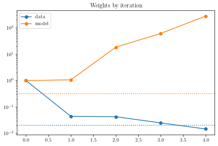

We document here the behaviour of variants of pypei on a testbed problem.

# Testbed problem

We take a standard SIR model:

$$\begin{aligned}
S' &= -\beta SI/N \\
I' &= \beta SI/N - \alpha I\\
R' &= \alpha I\\
N &= S + I + R\\
\end{aligned}$$

and solve it forward it time over $t \in [0, 20]$ for the parameters $\theta_{true}$ and initial conditions ${y_0}_{true}$ to get a true solution $y_{true}$:

$$\begin{aligned}
\theta_{true} = [\beta_{true}, \alpha_{true}] &= [1.3, 0.2]\\
{y_0}_{true} = [{S_0}_{true}, {I_0}_{true}, {R_0}_{true}] &= [999, 1, 0]
\end{aligned}$$

We generate (noisy) data $y$ by observing only the states $[S, R]$ over a time period $t \in [0, 7]$, which we encapsulate in an observation function, $g(\cdot)$, subject to Poisson noise:

$$y \sim \text{Poisson}(g(y_{true}))$$

# Standard variant

We fit the objective function $H_{standard} = -2\log\mathcal{L}_{standard}$:

$$
H_{standard} = \lVert L(y - g(\Phi c))\rVert^2 + \lVert W(D\Phi c - f(\Phi c, \theta)) \rVert^2 - 2\log{|L|} - 2\log{|W|}
$$
where
$$L = \frac{1}{\sigma_L} \mathbb{I},\qquad W = \frac{1}{\sigma_W} \mathbb{I}$$
and we define the weights:
$$w = \left[\frac{1}{\sigma_L}, \frac{1}{\sigma_W}\right]$$

We solve this iteratively:

1. Set the iteration number $i=0$.
2. Set initial guess $c^{(0)}, \theta^{(0)}$ and initial weights $w^{(0)}$.
3. Minimise $H_{standard}$ over $c, \theta$ for given weights $w^{(i)}$ $\to c^{(i+1)}, \theta^{(i+1)}$.
4. Minimise $H_{standard}$ over $w$ for given $c^{(i+1)}, \theta^{(i+1)}$ $\to w^{(i+1)}$.
5. If $i$ \< maximum iterations, set iteration number $i \gets i+1$ and return to step 2.

We shortcut step 4 by instead doing:

$w^{(i+1)} \gets s(c^{(i+1)}, \theta^{(i+1)})$
  
where $s(c, \theta)$ = $\sqrt{\frac{n}{r(c, \theta)}}$ and $r$ is the residual function, $n$ the length of $r(c, \theta)$.

In this case $r(c, \theta) = \left[y - g(\Phi c), \;D\Phi c - f(\Phi c, \theta)\right]$. We justify this by stating that this is the `optimal' solution via solution of the KKT conditions, once $r$ is known (assuming there are no constraints imposed on the problem, which is not necessarily true). 

Here, we `absorb' scaling into the covariance matrices, but because we do not optimise for them directly, we don't get the proper scalings.

## Results
We use initial weights $[1, 1]$, and initial guesses $\sim \text{Poisson}(1000)$.
We have to terminate the iteration early, at iteration $i=1$ where $w=[0.05, 0.49]$, and recover parameter estimates $\beta = 1.19, \alpha = 0.19$. Runtime is 8.85s for 4 iterations.

The model weights grow at each iteration, we can see that it leads to underfits.

Iteration 0 seems well fit. By iteration 2, the fit is already degraded, and by iteration 3, the estimate is very underfit.

# Delta-t variant
We fit the objective function $H_{\Delta t} = -2\log\mathcal{L}_{\Delta t}$:

$$
H_{\Delta t} = \lVert L(y - g(\Phi c))\rVert^2 + \lVert W(\,\sqrt{\Delta t}(D\Phi c - f(\Phi c, \theta))\,) \rVert^2 - 2\log{|L|} - 2\log{|W|}
$$
where
$$L = \frac{1}{\sigma_L} \mathbb{I},\qquad W = \frac{1}{\sigma_W} \mathbb{I}$$
and we define the weights:
$$w = \left[\frac{1}{\sigma_L}, \frac{1}{\sigma_W}\right]$$

Essentially, we introduce a scaling $\Delta t$ into the _residual_ function.
This fixes the consistency problem with the SDE interpretation, that is not explicitly addressed in the standard variant (with shortcut).

## Results

We use initial weights $[1, 1]$, and initial guesses $\sim \text{Poisson}(1000)$.
We have to terminate the iteration early, at iteration $i=1$ where $w=[0.05, 0.49]$, and recover parameter estimates $\beta = 1.19, \alpha = 0.19$. Runtime is 

The model weights seem to grow at each iteration. This eventually leads to underfits.

Iteration 0 seems slightly overfit, due to the oscillations in the estimate at small time in $S$. By iteration 2, the fit is already degraded, and by iteration 3, the estimate is very underfit.

# Balanced variant

Here, we fit the objective $H_{balanced} = -2\log \mathcal{L}_{balanced}$

$$
H_{balanced} = \frac{1}{n}\lVert L(y - g(\Phi c))\rVert^2 + \frac{1}{m}\lVert W(D\Phi c - f(\Phi c, \theta)) \rVert^2 - 2\log{|L|} - 2\log{|W|}
$$
where
$$L = \frac{1}{\sigma_L} \mathbb{I}\in \mathbb{R}_+^{n\times n},\qquad W = \frac{1}{\sigma_W} \mathbb{I} \in \mathbb{R}_+^{m\times m}$$
and we define the weights:
$$w = \left[\frac{1}{\sigma_L}, \frac{1}{\sigma_W}\right]$$

The idea of this balancing is to make the magnitudes of the two parts of the objective function similar.
Consider if $m \to \infty$, i.e. a continuous integral. Then the objective function becomes dominated by the model. Similarly, if we had an `infinite' amount of data, we would force our function into interpolation, instead of ``smoothing''.

We find that in general, this leads to _convergent_ behaviour in the weights, and thus convergence in the state/parameter estimates. This may be because the two terms are similar in magnitude after the weight update step of each iteration, meaning the objective is not weighted to one term or the other.

## Results

We use initial weights $[1, 1]$, and initial guesses $\sim \text{Poisson}(1000)$.
We iterate for 10 iterations, which takes 25s. At the final iteration ($i=9$), we get a parameter estimate of $\beta = 1.0, \alpha=0.16$.

We see that the weights converge, and approach some value (when plotted in the weight-space).

We do see that the parameter estimate degrades after iteration $i=4$, and suspect this continues. This may suggest that the balancing is not complete.

# Balancing with Delta-t
We can combine balancing with $\Delta t$ variant, to construct what should be the `ideal' objective function.

## Results

We see that when we start the initial weights at $[1,1]$, we do not get the results we want. Examining the weights plot, we see that the solution converges towards an interpolation-style fit.
This suggests that there are a large quantity of ``stable'' weights that the algorithm can converge to
